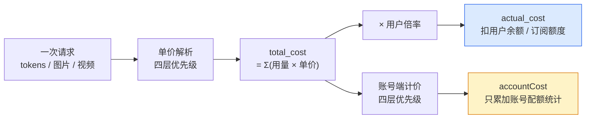
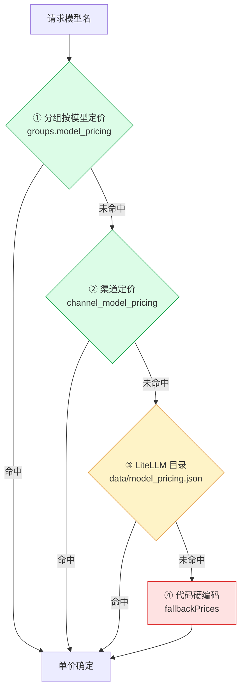
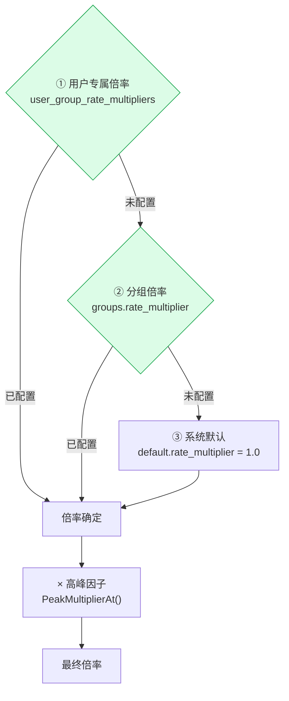
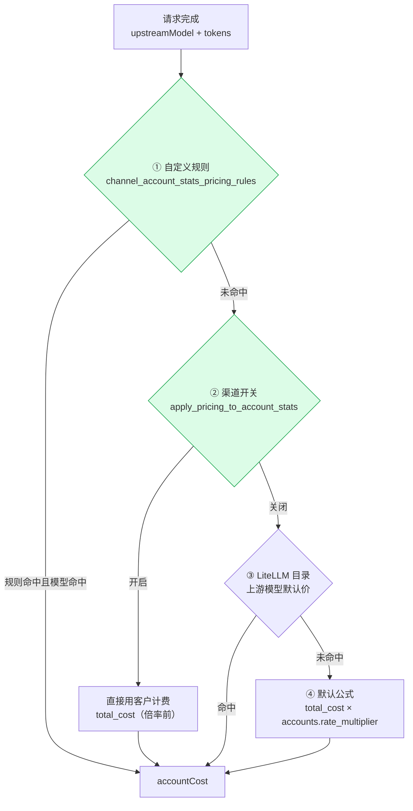
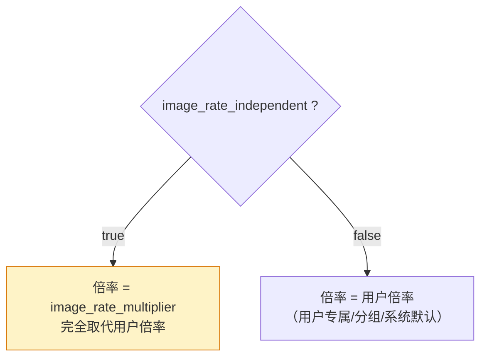
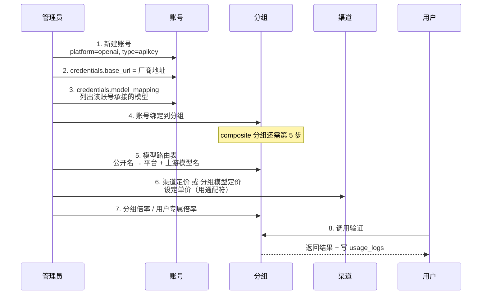
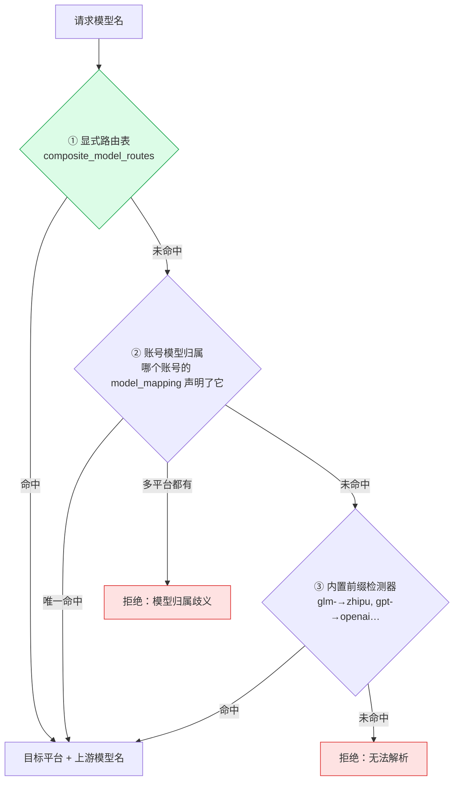
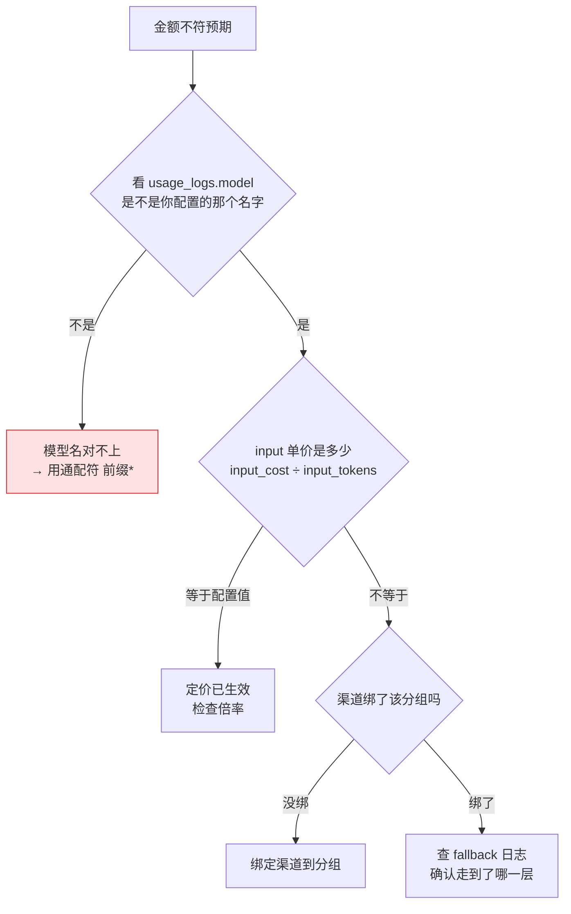

# 计价策略与厂商配置说明

> 适用：sub2api 网关（本文档基于 2026-09-13 的实际代码与线上验证整理）
>
> **前提：sub2api 是只读基础层，本文所有操作均为「管理端配置」，不涉及任何代码改动。**

---

## 一、总览：两条互不影响的计价线

系统里同时跑着**两套独立的计价**，用途完全不同。混淆它们是排查费用问题时最常见的错误。



| | 用户端 | 账号端 |
|---|---|---|
| **回答的问题** | 向用户收多少钱 | 这个上游账号消耗了多少成本 |
| **落到哪里** | 扣余额 / 扣订阅额度 / 扣 Key 配额 | `accounts.quota_used` 统计 |
| **日志字段** | `total_cost` → `actual_cost` | `account_rate_multiplier` 参与的 accountCost |
| **改它影响谁** | 用户账单 | 只影响账号用量报表 |

> ⚠️ **`accounts.rate_multiplier` 不会影响用户账单。** 线上实测：某账号设 5.0 时，用户仍按原价扣费。想给用户加价请看第二节。

---

## 二、用户端计价

### 2.1 公式

```
actual_cost = Σ(用量 × 单价) × 倍率 × 高峰因子
              └──── total_cost ────┘
```

### 2.2 单价：四层优先级



| 层 | 存放位置 | 管理端入口 | 能否自助配置 |
|---|---|---|---|
| ① 分组按模型定价 | `groups.model_pricing`（jsonb） | 分组 → 编辑 → **模型定价** | ✅ 推荐 |
| ② 渠道定价 | `channel_model_pricing` | 渠道 → 编辑 → **模型定价** | ✅ 需渠道已绑该分组 |
| ③ LiteLLM 目录 | `data/model_pricing.json` | 无（远程同步） | ⚠️ 见下 |
| ④ 代码兜底 | `billing_service.go` 的 `fallbackPrices` | 无 | ❌ 需改代码 |

**关于第 ③ 层**：文件每 10 分钟校验哈希、每 24 小时从远程仓库重新下载，**直接编辑会被覆盖**。若必须在此层干预，用官方扩展点 `pricing.override_file`（环境变量 `PRICING_OVERRIDE_FILE`，填容器内路径），它在每次同步后重新应用，且目录里没有的模型也能新增。

**模型名匹配规则**（①②层通用）：

| 写法 | 行为 |
|---|---|
| `glm-5-3-flash-260828` | 精确匹配，**优先级最高** |
| `glm-5-3-flash*` | 末尾通配，前缀匹配 |
| 两者都配 | 精确胜出 |

> 🔴 **最常见的坑**：配的名字必须是**计费时实际使用的模型名**。若分组配了 composite 路由把 `glm-5-3-flash` 改写成 `glm-5-3-flash-260828`，那么**计费用的是改写后的长名**，定价里写短名不会生效。线上实测踩过一次。用通配符 `glm-5-3-flash*` 可同时覆盖两者，且上游换版本号后无需再改。

### 2.3 倍率：三层 + 高峰



| 层 | 位置 | 管理端入口 | 粒度 |
|---|---|---|---|
| ① 用户专属 | `user_group_rate_multipliers` | 分组 → 编辑 → **专属倍率** | 用户 × 分组 |
| ② 分组默认 | `groups.rate_multiplier` | 分组 → 编辑 → **倍率** | 整个分组 |
| ③ 系统默认 | 配置 `default.rate_multiplier` | 无 | 全局 |
| 高峰因子 | `groups.peak_rate_multiplier` | 分组 → **高峰时段倍率** | **仅订阅类型分组** |

**倍率的最细粒度是「用户 × 分组」，不存在「按模型的倍率」。** 全库 21 个 `*_multiplier` 列中没有任何一个以模型为键。

### 2.4 怎么提高 / 降低用户端价格

| 目标 | 操作 | 生效范围 |
|---|---|---|
| 全体用户统一涨价 | 分组 → 倍率 改为 `N` | 该分组所有用户、所有模型 |
| 只给某个用户涨价 | 分组 → 专属倍率 → 添加该用户 | 该用户在该分组 |
| **只给某个模型涨价** | 分组模型定价里把该模型单价填成 `目录价 × N` | 该分组所有用户，仅该模型 |
| 某用户 × 某模型差异化 | **必须拆分组**（见下） | — |
| 降价 | 同上，倍率或单价填小于 1 / 更低的值 | — |
| 免费 | 倍率填 `0`（允许） | — |

**「某用户 × 某模型」差异化的做法**（单价是分组级的，同分组所有用户共享）：

```
分组 A（普通）   模型定价 = 目录价        用户倍率 2.0  → 实收 2×
分组 B（VIP）    模型定价 = 目录价 × 1.5  用户倍率 1.5  → 实收 2.25×
```

同一批账号可同时绑到多个分组，不必重复建账号。

> 💡 **叠乘关系**：`单价 × 倍率`。若某模型当前走的是代码兜底价（可能偏离真实成本），建议**先把单价修正到真实成本，再用倍率加价**，否则毛利算不准。

---

## 三、账号端计价

回答「这个上游账号花了多少成本」，只影响账号配额统计，**不进用户账单**。

### 3.1 四层优先级



### 3.2 各层怎么配

| 层 | 位置 | 管理端入口 | 说明 |
|---|---|---|---|
| ① 自定义规则 | `channel_account_stats_pricing_rules` + `..._model_pricing` | 渠道 → 编辑 → **账号统计定价规则** | 规则按 `group_ids` / `account_ids` 过滤，再按模型匹配；**始终尝试，不受开关影响** |
| ② 沿用客户计费 | `channels.apply_pricing_to_account_stats` | 渠道 → 编辑 → 勾选 | 账号成本 = 客户计费（倍率前） |
| ③ 目录默认价 | 自动 | 无 | 用上游模型在 LiteLLM 目录里的价 |
| ④ 默认公式 | `accounts.rate_multiplier` | 账号 → 编辑 → **倍率** | 最粗的一档 |

### 3.3 怎么提高 / 降低账号端价格

| 目标 | 操作 |
|---|---|
| 整体按比例调整某账号成本 | 账号 → 倍率（第 ④ 层） |
| 让账号成本等于对客报价 | 渠道 → 勾选「应用模型定价到账号统计」（第 ②层） |
| 按模型精确设定账号成本 | 渠道 → 账号统计定价规则，指定 `账号/分组 + 模型 + 单价`（第 ① 层，最精确） |

> ⚠️ 若你设 `accounts.rate_multiplier = 5` 是为了给用户加价，**方向错了** —— 它只会让该账号的配额统计虚高 5 倍，用户账单纹丝不动。

---

## 四、媒体类计价（图片 / 视频 / 搜索 / 音频）

### 4.1 计费模式

`BillingMode` 共四值，在渠道/分组的定价条目里选择：

| 模式 | 计价方式 | 用到的字段 |
|---|---|---|
| `token` | 按 token | `input_price` / `output_price` / `cache_*_price` |
| `per_request` | 按次 | `per_request_price` |
| `image` | 按张 | `per_request_price` + 尺寸档位 |
| `video` | **按秒** | 每秒价 × 时长 × 数量 |

### 4.2 图片单价（三层）

```
分组 image_price_1k / 2k / 4k
  → LiteLLM 目录 output_cost_per_image
  → 代码默认 $0.134（2K 档 ×1.5，4K 档 ×2）
```

管理端：**分组 → 编辑 → 图片定价**（含 1K / 2K / 4K 三档）

### 4.3 视频单价（三层）

```
分组 video_model_prices  (模型族 → 分辨率 → USD/秒)
  → 分组 video_price_480p / 720p / 1080p
  → 代码默认
```

```
总价 = 每秒价 × 时长(秒) × 视频数
```

### 4.4 媒体倍率：独立开关

图片和视频各有一个**独立倍率开关**，行为与文本完全不同：



| 类型 | 独立开关 | 独立倍率列 | 是否叠高峰因子 |
|---|---|---|---|
| 文本 token | — | — | ✅ 叠 |
| 图片 | `image_rate_independent` | `image_rate_multiplier` | ❌ **不叠** |
| 视频 | `video_rate_independent` | `video_rate_multiplier` | ❌ 不叠 |
| 搜索 / 音频 | — | 用基础用户倍率 | ❌ 不叠 |

> 🔴 **开了 independent 就是完全取代，不是相乘。** 例如用户专属倍率 2.0、`image_rate_multiplier` 3.0、开了独立开关 → 图片按 **3.0** 计，不是 6.0。
>
> 另：图片请求的 `usage_logs.rate_multiplier` 记的是**图片倍率**，不是文本倍率。

---

## 五、配置一个 OpenAI 兼容厂商 + 新增模型

### 5.1 先明确一个概念

**`platform` 字段表示的是「协议」，不是「厂商」。** 系统里 8 个平台值（anthropic / openai / gemini / antigravity / grok / kimi / zhipu / deepseek）是**闭集，不能自助新增**。

任何 OpenAI 兼容厂商（火山方舟、硅基流动、自建 vLLM…）都应配成 **`platform = openai` + 自定义 `base_url`**。这是官方设计，不是变通 —— kimi/zhipu/deepseek 在代码注释里也被明确归为「国产 OpenAI 兼容供应商，与 openai/grok 一样经 OpenAI 网关转发」。

代价仅有一个：管理界面会把它显示成「OpenAI」而非厂商名。

### 5.2 配置时序



### 5.3 分步配置表

| # | 在哪配 | 填什么 | 不配的后果 |
|---|---|---|---|
| 1 | 账号 → 平台 | `OpenAI` | — |
| 2 | 账号 → `base_url` | 厂商的 OpenAI 兼容端点 | 打到官方 OpenAI |
| 3 | 账号 → `model_mapping` | 该账号承接的模型（**白名单**） | 留空 = 放行所有模型 |
| 4 | 账号 → 分组 | 绑定 | 调度找不到账号 |
| 5 | 分组 → 模型路由表 | `公开名` → `目标平台 + 上游模型名` | composite 分组下模型名对不上会 404 |
| 6 | 分组/渠道 → 模型定价 | 单价（**建议用 `前缀*`**） | 落到目录价或代码兜底，金额可能严重偏离 |
| 7 | 分组 → 倍率 | 加价系数 | 按 1.0 计 |

**`model_mapping` 的关键语义**：

| 配置 | 行为 |
|---|---|
| 留空 | **放行所有模型** |
| 非空 | **白名单**，不在表里的模型该账号不接（被踢出候选集） |
| `glm-*` | 支持末尾通配 |

这正是**同一分组内多账号分流**的机制 —— 例如 `gpt-*` 走 A 账号、`glm-*` 走 B 账号，互不干扰，且不挑平台。

### 5.4 新增图片 / 视频模型

在上面 7 步基础上，额外：

| 类型 | 额外配置 |
|---|---|
| 图片 | 定价条目 `billing_mode = image`；分组 → 图片定价填 1K/2K/4K；按需开 `image_rate_independent` |
| 视频 | 定价条目 `billing_mode = video`；分组 → 视频定价填 480p/720p/1080p，或用 `video_model_prices` 按模型族设每秒价；按需开 `video_rate_independent` |

> 视频是**按秒**计费，填的是 USD/秒，不是每条视频的价。

### 5.5 composite 分组的三层路由

若分组平台是 `composite`（一个 Key 调多厂商），模型 → 平台的解析顺序：



> 🔴 **路由表做的是双重工作**：改写模型名 **+ 强制指定目标平台**。
>
> 例：火山方舟托管的 GLM，账号是 `openai` 平台。但内置检测器会把 `glm-` 判给 `zhipu`。**只有显式路由表把 `target_platform` 钉成 `openai`，才能绕过检测器走到火山账号。** 删掉这条路由，请求会去找不存在的 zhipu 账号而失败。

---

## 六、排查手册

### 6.1 「配了定价但金额不对」



**判别技巧**：优先看 **input 单价**，不要看 output。output 常与兜底价巧合相同，看不出区别。

```sql
select model, input_tokens, input_cost,
       input_cost / nullif(input_tokens,0) * 1000000 as 每M美元
from usage_logs order by id desc limit 1;
```

### 6.2 常用排查语句

| 目的 | 命令 |
|---|---|
| 看最近一次计费明细 | `select * from usage_logs order by id desc limit 1;` |
| 确认走没走代码兜底 | `docker logs sub2api \| grep "Using fallback pricing"` |
| 看分组倍率 | `select id,name,rate_multiplier from groups;` |
| 看用户专属倍率 | `select * from user_group_rate_multipliers;` |
| 看渠道定价 | `select channel_id,models,input_price,output_price from channel_model_pricing;` |
| 看渠道是否绑分组 | `select * from channel_groups;` |

> `admin/channel_handler.go` 打出的 fallback 日志是**保存渠道时的后台预览**，不是实际请求的计费路径，别拿它当依据。

---

## 七、陷阱清单

| # | 陷阱 | 后果 |
|---|---|---|
| 1 | 管理端填 **$/百万 token**，数据库存 **per-token** | 直接填 `0.000002` 会差 100 万倍 |
| 2 | 定价里写短名，计费用长名 | 定价静默失效，落到兜底价 |
| 3 | `accounts.rate_multiplier` 当成用户加价开关 | 用户账单不变，账号统计虚高 |
| 4 | 开了 `image_rate_independent` 以为是相乘 | 实为**完全取代**用户倍率 |
| 5 | 渠道定价没把渠道绑到分组 | 查不到定价，静默兜底 |
| 6 | 删掉 composite 路由表，以为只是改名 | 目标平台失去指定，请求找不到账号 |
| 7 | 直接编辑 `data/model_pricing.json` | 24 小时内被远程同步覆盖 |
| 8 | `groups.model_routing`（模型路由）以为通用 | **仅目标平台为 anthropic 时生效**，其余场景开了也空转 |
| 9 | 视频定价按「每条」填 | 实为**每秒**，会少收数十倍 |
| 10 | 账号 `model_mapping` 留空以为是禁用 | 留空 = **放行所有模型** |

---

## 附：关键字段速查

| 需求 | 表 / 列 | 管理端位置 |
|---|---|---|
| 用户加价（全组） | `groups.rate_multiplier` | 分组 → 倍率 |
| 用户加价（单人） | `user_group_rate_multipliers` | 分组 → 专属倍率 |
| 单模型改价 | `groups.model_pricing` | 分组 → 模型定价 |
| 单模型改价（渠道级） | `channel_model_pricing` | 渠道 → 模型定价 |
| 账号成本倍率 | `accounts.rate_multiplier` | 账号 → 倍率 |
| 账号成本精确定价 | `channel_account_stats_pricing_rules` | 渠道 → 账号统计定价规则 |
| 厂商地址 | `accounts.credentials.base_url` | 账号 → base_url |
| 账号承接的模型 | `accounts.credentials.model_mapping` | 账号 → 模型映射 |
| 模型名改写 + 定平台 | `composite_model_routes` | 分组 → 模型路由表 |
| 图片价 | `groups.image_price_1k/2k/4k` | 分组 → 图片定价 |
| 视频价（USD/秒） | `groups.video_price_*` / `video_model_prices` | 分组 → 视频定价 |
